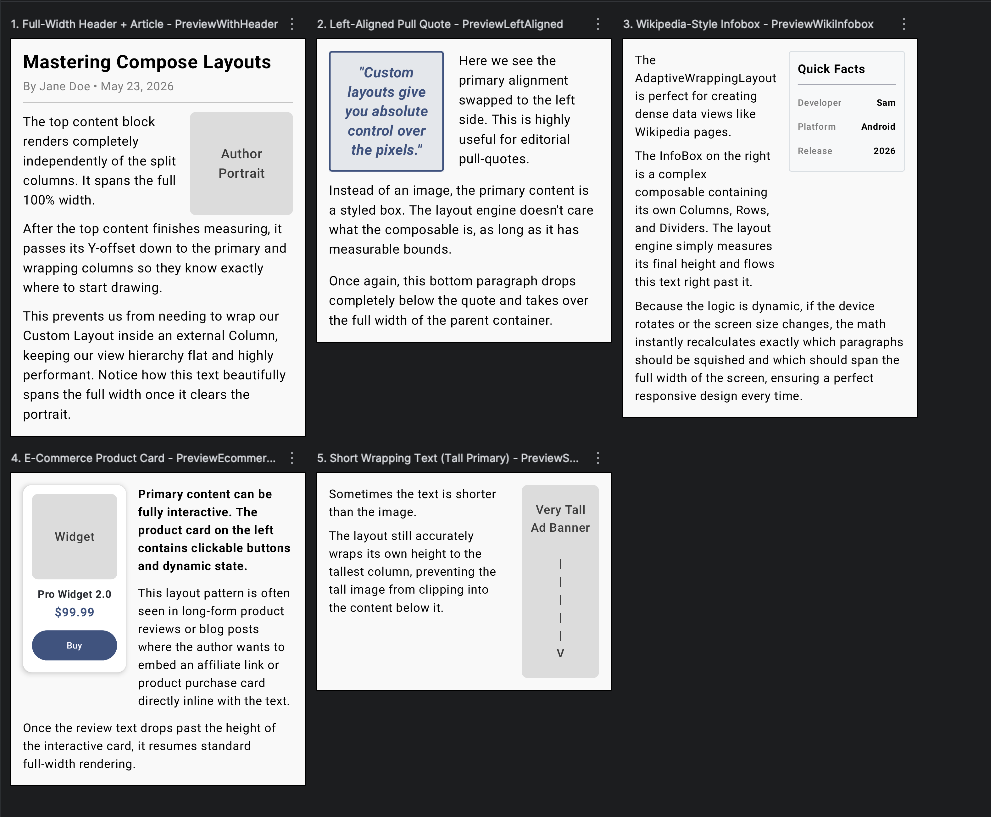

# AdaptiveWrappingLayout for Jetpack Compose 

A custom Jetpack Compose layout that brings CSS-style `float: left` and `float: right` text-wrapping capabilities to Android.

By default, Jetpack Compose (`Column`, `Row`, `FlowRow`) treats text blocks as rigid rectangles, making it impossible to wrap a single paragraph natively around an image or pull-quote. **AdaptiveWrappingLayout** solves this by dynamically measuring and splitting content constraints, allowing your text to flow beautifully around obstacles and span full-width once the obstacle is cleared.

## Features

* **CSS-Style Floats:** Pin your images or UI blocks to the `Left` or `Right`.
* **Smart Wrapping:** Content smoothly flows around obstacles, then snaps back to full width once clear.
* **Built-in Headers:** Use the `topContent` slot for full-width titles above your columns.
* **Highly Performant:** Keeps your view hierarchy flat (no nested `Column`s or `Row`s).
* **Fully Responsive:** Adapts instantly to screen rotations and resizing.
## Usage

Simply copy `AdaptiveWrappingLayout.kt` into your project and use it like a standard Compose layout.

```kotlin
AdaptiveWrappingLayout(
    modifier = Modifier.padding(16.dp),
    primaryAlignment = PrimaryAlignment.Right, // Or PrimaryAlignment.Left
    primaryWidthRatio = 0.4f, // Takes up 40% of the screen width
    horizontalSpacing = 16.dp,
    verticalSpacing = 12.dp,
    
    // 1. Optional Header (Spans 100% width)
    topContent = {
        Text("Article Title", style = MaterialTheme.typography.headlineMedium)
    },
    
    // 2. The "Obstacle" (Image, Quote, Infobox)
    primaryContent = {
        Image(
            painter = painterResource(id = R.drawable.my_image),
            contentDescription = "Floating Image"
        )
    },
    
    // 3. The Wrapping Text
    wrappingContent = listOf(
        { Text("This paragraph will flow beside the image.") },
        { Text("If this paragraph drops below the image, it will expand to 100% width automatically.") }
    )
)
```


